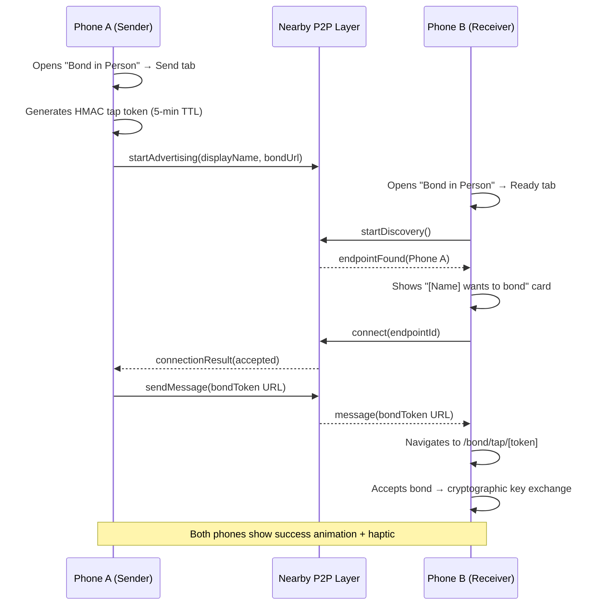
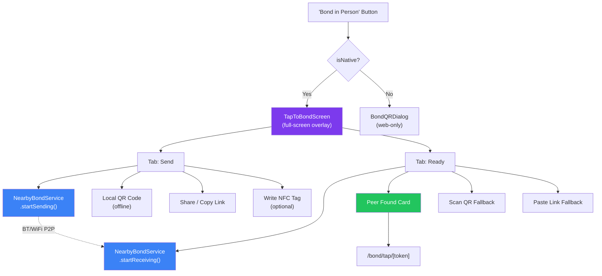

# Architecture Decisions

## [AD-001] Mobile Compose UX Transition
**Date**: 2026-04-27
**Status**: Decided

### Context
The original mobile design used a Floating Action Button (FAB) that opened a full-screen modal or bottom sheet for post composition. This pattern felt disconnected from the feed-centric nature of the application and introduced unnecessary friction for quick updates.

### Decision
We are moving away from the FAB-based compose pattern on mobile in favor of a persistent, inline `ComposeBox` card at the top of the feed (Your Comms and Tribe feeds). 

### Consequences
- `ComposeFAB` has been removed from the global layout.
- `ComposeBox` is now injected directly into the scrollable feed area.
- Improved focus on content creation as part of the feed consumption flow.
- Reduced modal overhead and improved responsiveness on small viewports.

## [AD-002] Multi-Image Post Support
**Date**: 2026-04-27
**Status**: Decided

### Context
Users requested the ability to share multiple images in a single post, a standard feature in modern social platforms. The existing schema only supported a single `imageUrl` string.

### Decision
- Added `imageUrls` (JSON array of strings) to the `posts` table.
- Maintained legacy `imageUrl` for backward compatibility (points to the first image in the array).
- Updated `ComposeBox` to support multiple file uploads with a preview grid.
- Implemented membership-based upload limits:
  - `Human_Free`: 1 image
  - `Human_Paid` / `Human_Member`: 4 images
  - `Creator` / `Admin`: 10 images
- Refactored post cards (`TribePostCard`, `IntercomFeedItem`) to render responsive image grids.

### Consequences
- Richer media sharing capabilities.
- Clear monetization path via tiered upload limits.
- Database schema now supports structured multi-media payloads.

## [AD-003] Tap-First Bond UX with NameDrop-Style Proximity Discovery
**Date**: 2026-05-02
**Status**: Decided

### Context
The in-person bonding flow was QR-first with NFC as a secondary overlay. Investigation revealed that **iOS does not support phone-to-phone NFC data exchange** — no HCE, no P2P mode. Even Apple's NameDrop uses NFC only for proximity detection, then hands off to BT/WiFi. The original Web NFC bridge was dead code. QR generation relied on an external API (`qrserver.com`) that fails offline — exactly when in-person bonding is most needed.

### Decision
Replaced the QR-first flow with a **three-tier in-person bonding strategy**:

1. **Nearby P2P** (primary on native) — `@squareetlabs/capacitor-nearby-multipeer` wrapping Apple Multipeer Connectivity (iOS) and Google Nearby Connections (Android) for BT/WiFi phone-to-phone bond token exchange.
2. **QR Code** (universal fallback) — locally generated offline via the `qrcode` npm package.
3. **Share Link** (remote fallback) — standard share sheet / clipboard for non-proximity scenarios.
4. **NFC Tag Write** (power-user / events) — write bond URLs to physical NFC tags for conference/meetup setups.

### iOS NFC Constraints (Verified May 2026)

| Capability | iOS (CoreNFC) | Android |
|---|---|---|
| Read NDEF from physical tag | ✅ iPhone 7+ | ✅ |
| Write NDEF to physical tag | ✅ iPhone 7+ (in-app) | ✅ |
| Background Tag Reading | ✅ iPhone XS+ | ❌ |
| Phone-to-phone NFC | ❌ Never supported | ⚠️ Deprecated (Android Beam) |
| Phone acts as NFC tag (HCE) | ❌ | ✅ |

> **iOS 26 SDK Note:** The `NDEF` value for `com.apple.developer.nfc.readersession.formats` is disallowed when targeting min OS 15.0. Use `TAG` only — it includes NDEF tag reading capabilities.

### Bond-in-Person Flow

### Component Architecture

### Key Files

| File | Purpose |
|------|---------|
| `src/lib/capacitor/nearby-bond.ts` | P2P proximity service (Multipeer Connectivity / Nearby Connections) |
| `src/components/bond/tap-to-bond-screen.tsx` | Full-screen native bond experience with Send/Ready roles |
| `src/components/bond/nfc-tap-animation.tsx` | Pure CSS/SVG animation (sending/waiting/success states) |
| `src/lib/capacitor/nfc-bond.ts` | Physical NFC tag read/write (NOT phone-to-phone) |
| `src/lib/utils/qr-code.ts` | Offline QR generation via `qrcode` package |
| `src/components/dialogs/bond-qr-dialog.tsx` | Simplified web-only QR dialog |

### Consequences
- In-person bonding feels ceremonial and premium on native — NameDrop-style proximity discovery.
- Web users get a clean QR + share experience unchanged.
- QR codes work fully offline — no external API dependency.
- NFC tag writing enables event/meetup scenarios (write once, many people tap).
- Dead Web NFC bridge code (`nfc-bridge.ts`) removed.
- New native dependency: `@squareetlabs/capacitor-nearby-multipeer` — requires TestFlight rebuild.
- iOS `App.entitlements` updated with NFC formats; `Info.plist` updated with BT/Local Network/Bonjour descriptions.
