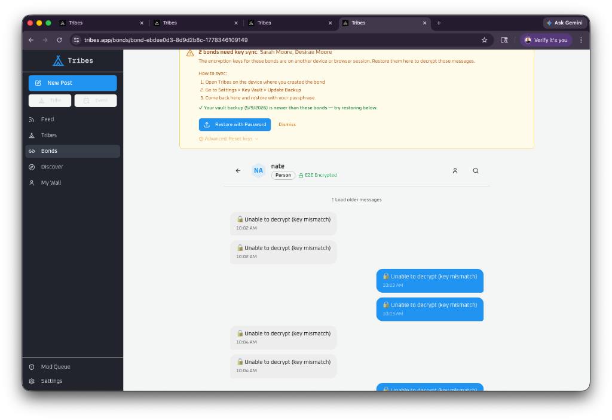
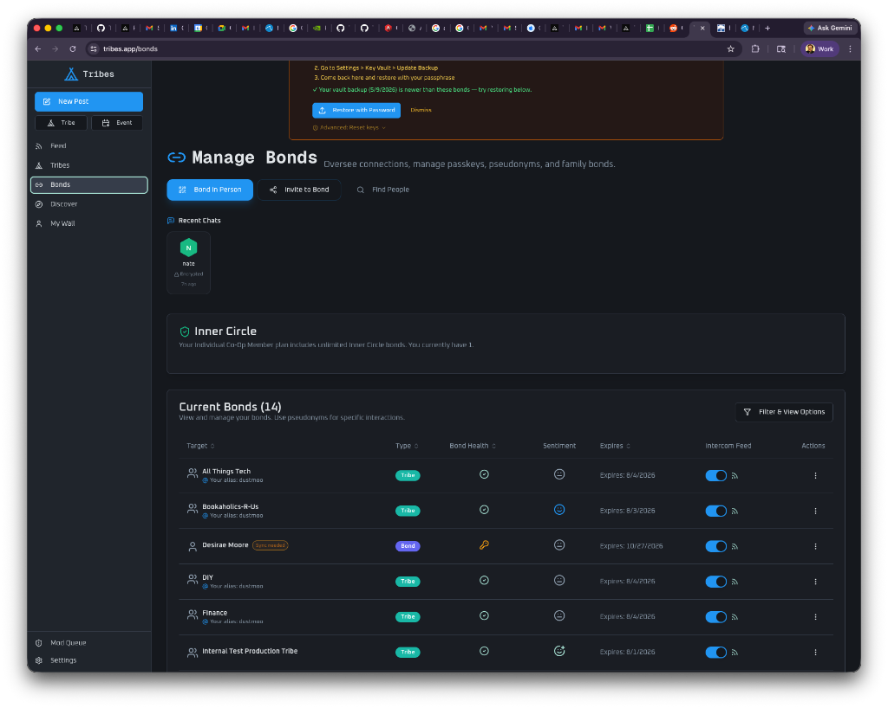
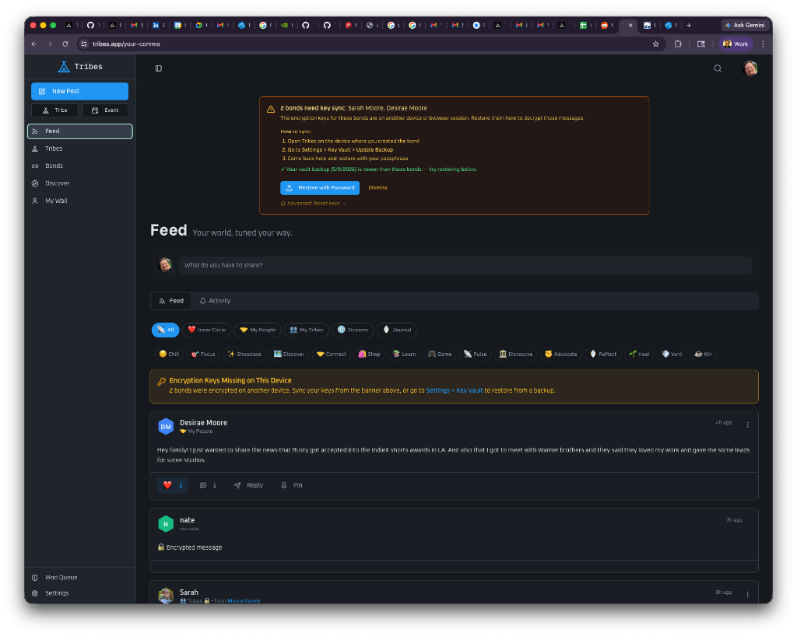

# What Happens When You Lose an Encryption Key (And How We Fixed It)

**TL;DR:** We lost a real encryption key in production. Not a test. A real bond, real messages, real breakage. Here's exactly what happened, what we built to prevent it, and why we chose not to build the "easy" fix.

---

## The Incident

Last week, during a vault sync between my phone and desktop, something went wrong. The vault restore clobbered my bond encryption key for a specific bond — the ECDH private key that lets me derive the shared secret with that person. The old key was overwritten. The old shared secret vanished.

The result:



Every single message in that chat — mine and theirs — shows "Unable to decrypt (key mismatch)." The bond shows as "healthy" because the *current* key pair is valid. But every historical message was encrypted with a shared secret derived from the old key. That key is gone. Those messages are gone — for me.

The other person can still read the full conversation. Their private key never changed. But I can't. And we can't recover it for them, because we never had the key in the first place. That's the whole point.

**This is what real encryption looks like.** It's not a marketing checkbox. When the key is gone, the data is actually gone. No admin panel. No support ticket. No backdoor. Math doesn't care about your feelings.

---

## What We Built

We spent a full day building what we're calling **Epoch-Aware Key Rotation** — a system that prevents this from ever happening again. Here's the architecture:

### The Problem

Before this fix, when a bond key rotated (vault restore, device switch, manual refresh), the old public key was simply overwritten. The old shared secret was deleted from IndexedDB and replaced with the new one. If you needed to read old messages encrypted with the previous key — tough luck.

### The Fix: Archive Before You Replace

**Phase 1: Key History Chain**

Every time a bond's public key changes, the old key is now archived to a `bond_key_history` table before it's replaced. The server stores:

- The old public key (JWK)
- A SHA-256 hash of the key (for fast lookup)
- A timestamp of when it was rotated

The client-side IndexedDB schema was upgraded to support **multiple shared secrets per bond** — one marked as "current" for new messages, and any number of "historical" ones for old messages. The keyPath changed from a simple `bondId` to a composite `${bondId}_${peerKeyHash}`, with an index on `bondId` for efficient lookup.

**Phase 2: Detect & Preserve**

The background key sync loop now detects when a peer's public key changes:

1. **Mark the old shared secret as historical** (don't delete it!)
2. **Fetch the peer's entire key history** from the server
3. **Derive and cache a shared secret for every historical key** we don't already have
4. **Derive the new current shared secret** from the peer's latest key

**Phase 3: Graceful Fallback**

When decrypting a message, the system now tries the current shared secret first, then falls back through all historical secrets until one works:

```
try current secret → success? done
    ↓ fail
try historical secret #1 → success? done
    ↓ fail
try historical secret #2 → success? done
    ↓ fail
"🔒 Key mismatch" (genuinely unrecoverable)
```

This means future key rotations preserve full conversational continuity. Both parties can read the entire history, even after multiple rotations.

---

## Bond Health: See It Before It Breaks

We also added a **Bond Health** indicator to the Bonds management page. It surfaces the cryptographic state of each bond at a glance:



- **Green check**: Keys are synced, shared secret is derived, encryption is active
- **Amber key + "Sync needed"**: Your browser is missing the private key for this bond (generated on another device). Vault restore needed.
- **Amber wrench**: Bond needs a key refresh

When bonds are orphaned, a prominent banner appears across the app with clear instructions:



---

## What We Chose NOT to Build

Here's where it gets interesting from a security design perspective.

There's an obvious "Phase 2" that would completely solve the lost-history problem: **re-wrapping**. The idea is simple — if my peer still has the old shared secret (they do, since their key never changed), their client could unwrap the old post keys and re-wrap them with the new shared secret. Then I could read the history again.

We considered it carefully and decided against it. Here's why:

**Re-wrapping is an attack vector.** It allows one party to modify cryptographic material that the other party depends on, and the server can't verify correctness. The server stores opaque blobs — it can't tell the difference between a legitimately re-wrapped grant and corrupted data. A compromised client could silently corrupt all historical grants for a bond, with no rollback and no detection.

Instead, we adopted **Option C: Accept the loss.** This is what Signal, WhatsApp, and every serious E2E messenger does. Key loss means history loss for the person who lost the key. The peer's copy is intact. New messages work fine.

The trade-off is real: I permanently lost access to that conversation on my side. But the alternative — adding an endpoint that lets clients rewrite each other's cryptographic grants — introduces a class of attack we're not willing to accept.

**We'd rather lose data than lose security.**

---

## The Integrity Pipeline

As with every deploy, the updated crypto source was automatically hashed and pushed to our public audit repo:

**[github.com/TribesSocialCoOp/tribes-encryption-audit](https://github.com/TribesSocialCoOp/tribes-encryption-audit)**

The new `key-rotation.ts` module is now part of the open-source audit set. The `crypto-integrity.json` manifest contains SHA-256 hashes for all 14 crypto source files, matched to build `97f806a`. You can verify the deployed code matches the published source.

---

## What Changed (Summary)

| Component | Change |
|-----------|--------|
| `bond_key_history` table | New — archives old public keys before rotation |
| `key-store.ts` | IDB v4 — multi-version shared secrets with composite keyPath |
| `key-rotation.ts` | New — historical secret caching + fallback decryption |
| `key-sync-provider.tsx` | Rotation detection: mark historical → fetch archive → derive new |
| `use-post-decryption.ts` | Fallback: try current → try historical → fail gracefully |
| `bond-service.ts` | Archive old key in `submitBondPublicKey`, `refreshBond`, `toggleInnerCircle` |
| `content-actions.ts` | PK collision fix: include `bondId` in grant primary key |
| `bond-table-row.tsx` | Bond Health UI with "Sync needed" badge |

---

## Lessons

1. **Real encryption has real consequences.** You can't have "we can't read your data" and also "we can recover your data." Pick one. We picked the first one.
2. **Archive before you mutate.** This should have been in the original design. It wasn't. Now it is.
3. **Health indicators matter.** Users need to see their cryptographic state before it becomes a problem, not after. The orphan detection and "Sync needed" badge exist so you never get surprised by "key mismatch."
4. **Don't build attack surface for convenience.** Re-wrapping would have been a nice UX win. It would also have been a security regression. We're a co-op, not a growth startup. We can take the L.

---

*This is a real incident report from a one-person engineering team building a social network with actual encryption. If you want to see the code, it's [open source](https://github.com/TribesSocialCoOp/tribes-encryption-audit). If you want to help test it, you're already here.*

---

**Tags:** `#security` `#encryption` `#devupdate` `#webdev`
