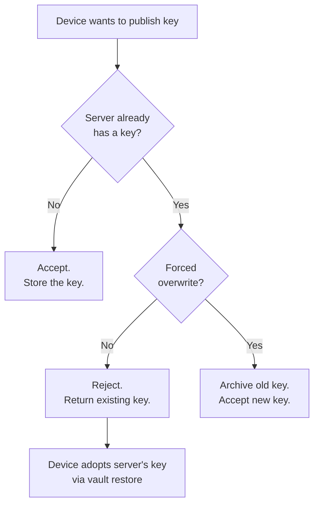
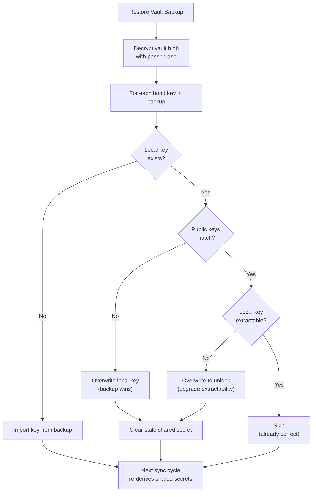
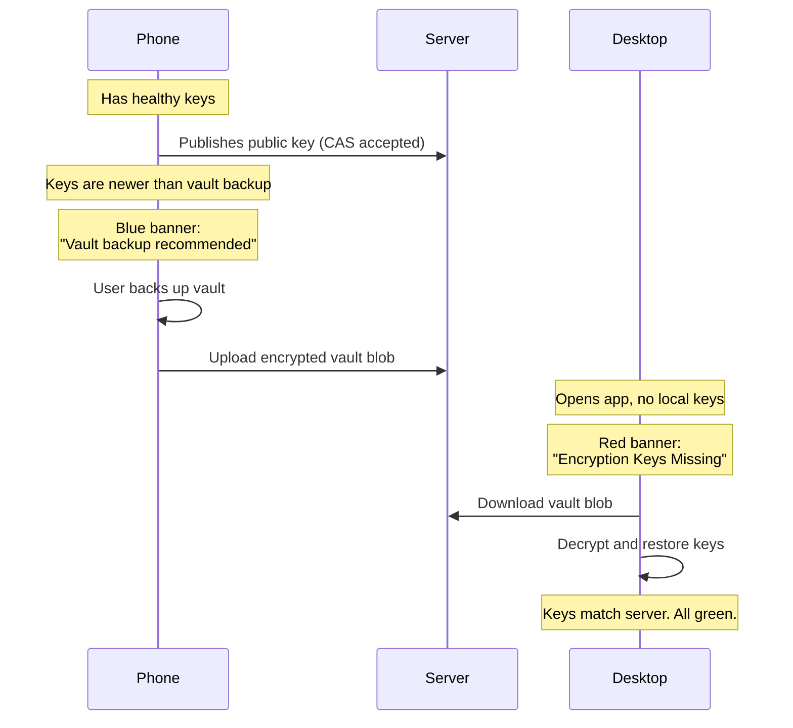

# Dev Update: Multi-Device Key Sync and the Split-Brain Fix

**TL;DR:** We fixed a race condition where two devices could fight over bond encryption keys, leaving both devices confused and unable to decrypt. Here's the architecture we built to prevent it, how vault restore now works, and what the new "Vault backup recommended" banner means.

---

## The Problem

If you use Tribes on both your phone and your laptop, here's what could go wrong before this fix:

1. You open the app on **Device A** (phone). It sees a bond with no server-side key. It generates a key pair and publishes the public key.
2. You open the app on **Device B** (desktop). Same thing. It also generates a key pair and publishes a public key.
3. Device B's key overwrites Device A's key on the server.
4. Now Device A has a private key that doesn't match the server. Device B has a private key that does match, but Device A's vault backup contains the *wrong* key.
5. Both devices show warnings. Restoring from vault makes it worse. Nobody wins.

This is a classic **split-brain** problem. Two devices, both acting rationally in isolation, but making globally inconsistent decisions.

---

## The Fix: Three Layers of Protection

### Layer 1: Compare-and-Swap (CAS) Guard

The server now enforces a "first writer wins" policy on bond public keys. When a device tries to publish a key, the server checks if one already exists:

Forced overwrites only happen when a user explicitly clicks "Reset Keys." Normal sync never overwrites. This eliminates the race condition entirely.

### Layer 2: Vault Restore (Backup Wins)

When you explicitly perform a vault restore, the app now treats the backup as the authority. The old behavior ("local wins") would skip bonds where the local key didn't match, silently leaving you with the wrong key. The new behavior:

Three outcomes per bond:
- **Skip:** Keys match, local key is already extractable. Nothing to do.
- **Overwrite (mismatch):** Different key. Vault wins. Stale shared secret is cleared.
- **Overwrite (locked):** Same key, but local copy is non-extractable. Vault version replaces it so the device can perform its own backups.

### Layer 3: Destructive Migration Removed

We had a one-time migration (`migrateBrokenBondKeys`) that was supposed to clean up broken key pairs. The problem: it ran per-device (gated by a localStorage flag), so every new browser that opened the app would wipe all server-side keys and regenerate them. This was the root cause of the original split-brain. It's been completely disabled. The function still exists in the codebase but has zero call sites.

---

## The "Vault Backup Recommended" Banner

We added a new blue banner that closes the loop on multi-device key management:

The banner appears when:
- All your bond keys are healthy (no orphans, no mismatches)
- But your vault backup is **older** than your newest key (or doesn't exist)

This tells the "winning" device: "You have the keys. Back them up so your other devices can get them too."

---

## Key Extractability: Removing the Security Theater

We discovered that keys restored from the vault were being imported as **non-extractable** (a Web Crypto API flag that prevents `exportKey`). This meant:

1. Device A generates extractable keys (can back up to vault)
2. Device A backs up to vault
3. Device B restores from vault, keys are imported as **non-extractable**
4. Device B tries to back up its vault... and fails. The keys are "locked" to that device.

The extractability flag is security theater in this context. If an attacker has access to your IndexedDB, they can use the CryptoKey object directly for decryption regardless of the flag. The real access control is the vault passphrase, not a browser API flag.

We fixed this by:
- Importing all restored keys with `extractable: true`
- Updating vault restore to overwrite matching-but-locked keys with unlocked versions

---

## All `publicKeyJwk` Mutation Paths (Audit)

For transparency, here is every code path that can modify a bond's server-side public key:

| Path | Location | Behavior |
|------|----------|----------|
| `submitBondPublicKey` | bond-service.ts | CAS guard: rejects if server already has key (unless force=true) |
| `refreshBond` | bond-service.ts | Explicitly preserves `publicKeyJwk` (no mutation) |
| `toggleInnerCircle` | bond-service.ts | Explicitly preserves `publicKeyJwk` (no mutation) |
| `approveReconnect` | bond-service.ts | Sets `publicKeyJwk: null` (intentional rotation at reconnect boundary) |
| `migrateBrokenBondKeys` | bond-actions.ts | Sets `publicKeyJwk: null` (DISABLED, zero call sites) |
| `rekeyOrphanedBonds` | key-sync-provider.tsx | Uses `force=true` (user clicks "Reset Keys" behind confirmation) |

---

## What Changed (Summary)

### Open-Source Crypto Module

These files are published to the [audit repo](https://github.com/TribesSocialCoOp/tribes-encryption-audit) on every deploy. You can verify the deployed code matches the published source.

| File | Change |
|------|--------|
| `vault-backup.ts` | Restore: backup wins on mismatch. Auto-unlock non-extractable keys. Clear stale shared secrets after overwrite. |
| `key-manager.ts` | `importPrivateKey` now imports with `extractable: true` so restored devices can back up their vault. |

### Application Layer (Not Open Source)

These files contain UI and server logic, not cryptographic primitives.

| File | Change |
|------|--------|
| `key-sync-provider.tsx` | Disabled destructive migration. Added `newestKeyDate` for backup freshness tracking. |
| `key-sync-banner.tsx` | New blue "Vault backup recommended" banner variant. |
| `bond-service.ts` | `submitBondPublicKey` updates `lastRefreshedAt` for accurate date tracking. |

---

## Lessons

1. **Per-device migrations are a trap.** A migration gated by localStorage will re-run on every new device. If the migration is destructive, it will destroy data on every new device. Gate destructive migrations server-side or not at all.
2. **"Local wins" is wrong for explicit restore.** If a user clicks "Restore," they want the backup to be the authority. Don't second-guess them.
3. **Extractability flags are not access control.** The Web Crypto extractability flag prevents `exportKey()` but doesn't prevent `deriveKey()` or `decrypt()`. It's a convenience restriction, not a security boundary. Don't let it block legitimate user workflows.
4. **Show the user their state.** The blue "backup recommended" banner and the red "keys missing" banner together form a complete picture. The winning device knows it needs to share. The losing device knows it needs to receive. No ambiguity.

---

*This is a real incident report from production. The split-brain happened to us (the founder, between phone and desktop) and we fixed it in real-time. If you want to see the code, it's [open source](https://github.com/TribesSocialCoOp/tribes-encryption-audit).*

---

**Tags:** `#security` `#encryption` `#devupdate` `#multidevice`
