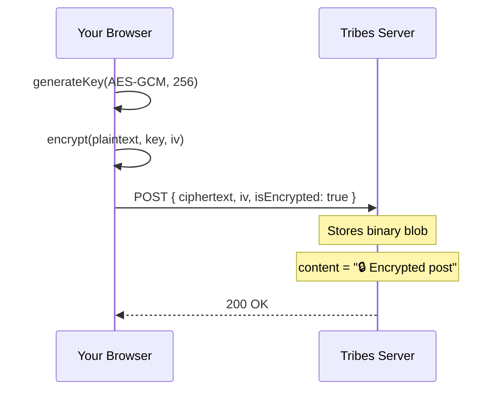
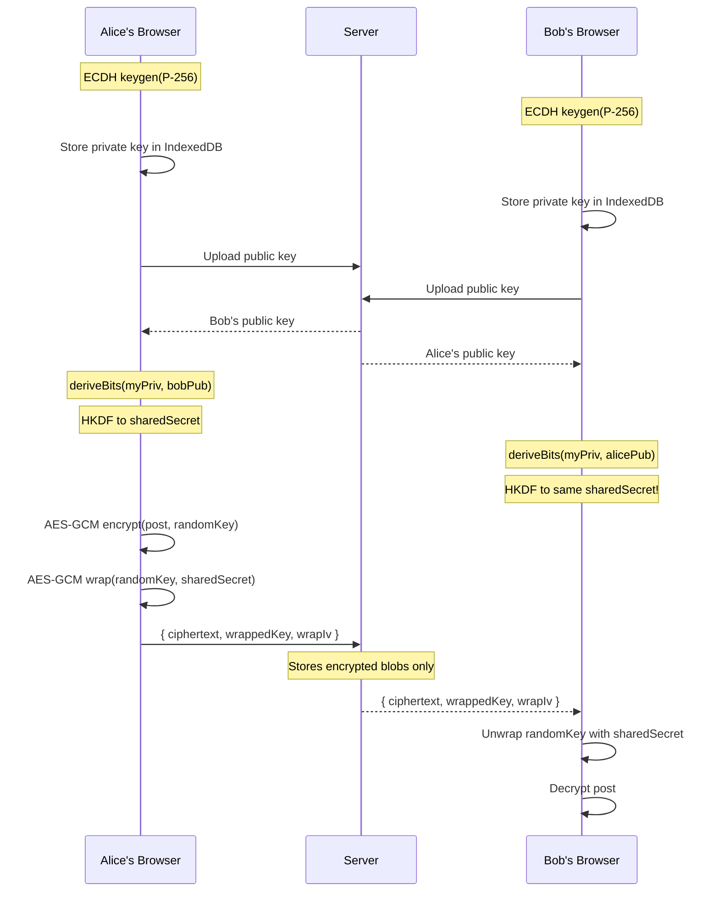
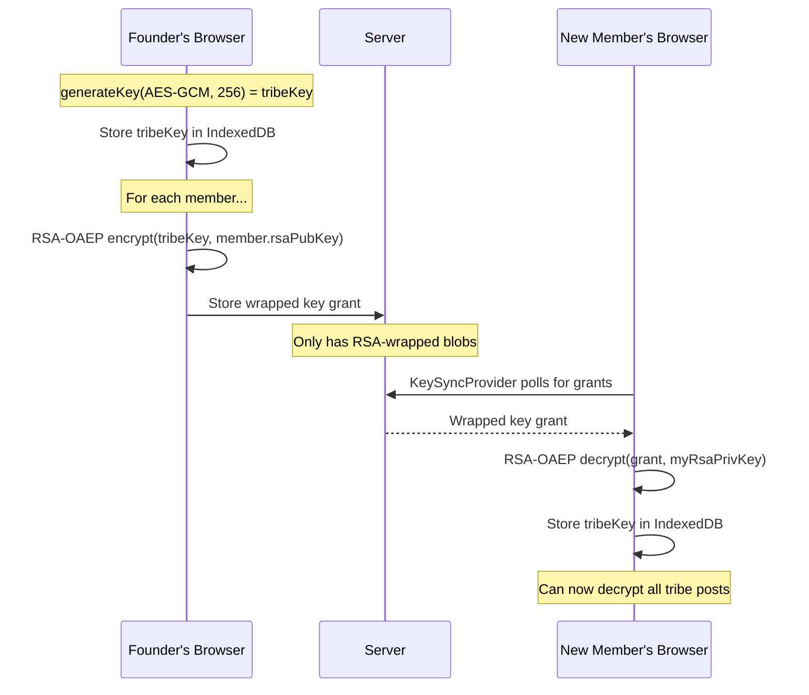
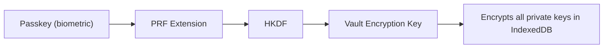
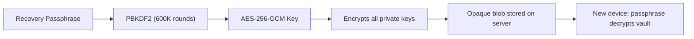

# You Don't Need My Source Code to Trust Me. Here's Why.

**TL;DR:** Tribes.app isn't open source (yet). But our encryption architecture means we *mathematically can't* read your private data, and you can verify that from your browser's DevTools right now. Here's exactly how it works.

---

## The Criticism

> "If it's not open source, I can't trust it."

This is a fair criticism. After a decade of "trust us" from platforms that sold your data, mined your attention, and enshittified their products the moment VCs needed returns, skepticism is healthy.

But I want to push back on the premise. **Open source is one mechanism for trust. It is not the only one, and for a social network, it's not even the strongest one.**

Here's what I mean.

## The Problem With "Just Open Source It"

Open source gives you *the ability to audit*. But let's be honest about what that means in practice:

1. **You're trusting the deploy matches the repo.** Unless you're building from source and self-hosting, you're trusting that `main` is what's running in production. Most people aren't diffing Docker images.
2. **Audit capacity is a myth for most projects.** The OpenSSL Heartbleed bug sat in open source code for *two years* before anyone noticed. "Many eyes" is aspirational, not guaranteed.
3. **Source code doesn't protect your data in transit or at rest.** Even if you can read every line, your data still transits their servers, sits in their database, and is subject to their operational practices.

I'm not anti-open-source. We'll likely open-source components over time. But I think there's a stronger trust primitive available, and we built on it.

## Cryptographic Guarantees > Source Code Visibility

Instead of asking you to trust our code, we designed the system so that **trust is enforced by math.** Your private data is encrypted *in your browser* before it ever reaches our servers. We store ciphertext. We don't have your keys. We literally cannot read it.

And unlike source code audits, **you can verify this yourself in about 30 seconds** using your browser's Network tab.

Here's the architecture.

---

## Three Layers of Encryption

Tribes uses three distinct encryption models, matched to three privacy contexts. All encryption uses the [Web Crypto API](https://developer.mozilla.org/en-US/docs/Web/API/Web_Crypto_API) (`crypto.subtle`). No custom crypto, no npm packages, just the browser's native cryptographic primitives.

### Layer 1: Journal (Personal, Zero-Knowledge)

**What:** Your private journal entries. Only you can read them, ever.

**How:**
- A per-user **AES-256-GCM** symmetric key is generated client-side and stored in IndexedDB
- Every journal post is encrypted in your browser before the API call
- The server stores: `ciphertext` (binary), `encryptionIv` (base64), `isEncrypted: true`
- The `content` column contains: `🔒 Encrypted post` (a static placeholder)



**What we can see:** A binary blob and an IV. That's it.
**What we can't do:** Read your journal. Reconstruct your key. Anything useful.

### Layer 2: Bond Encryption (Pairwise E2E)

**What:** Messages and posts shared between you and a specific person (your "bonds", think encrypted DMs, but for posts too).

**How:**
- Each bond generates an **ECDH P-256** key pair on each side
- Public keys are exchanged via the server (the only thing we see)
- Each client derives the **same shared secret** independently using ECDH key agreement
- The shared secret is run through **HKDF (SHA-256)** to derive a proper AES-256-GCM encryption key
- Posts are encrypted with a random per-post AES key, which is then "wrapped" (encrypted) with the ECDH-derived shared secret



**What the server sees:** Two public keys, and encrypted blobs. The shared secret is *never transmitted*. It's derived independently on each device from the ECDH math.

**Why this is strong:** Even if someone compromises our database, they get public keys and ciphertext. Without either party's private key (which lives only in their browser's IndexedDB), the data is meaningless.

### Layer 3: Private Tribes (Group Encryption)

**What:** Posts in private tribes. All members can read them, but non-members and the platform cannot.

**How:**
- When a tribe founder creates a private tribe, an **AES-256-GCM group key** is generated
- The group key is distributed to members via **RSA-OAEP (4096-bit)** envelope encryption
- Each member has an RSA identity key pair (separate from their ECDH bond keys)
- The tribe key is wrapped (encrypted) with each member's RSA public key, stored as a "key grant"
- Members unwrap the tribe key with their RSA private key, store it locally, and can now decrypt all tribe posts



**Design trade-off:** This is "softer" than pairwise E2E. The tribe founder (or any key admin) holds the raw key and distributes it. If a founder's device is compromised, the group key is exposed. But the *server* still never sees the raw key. It only stores RSA-wrapped copies that are useless without each member's private RSA key.

**Why not just use Signal Protocol / MLS?** We considered it. For group messaging, those protocols are superior. But for a *feed model* where posts are written once and read by many members at different times, a shared symmetric key is simpler, faster, and sufficient. We may add ratcheting for direct chat in the future.

---

## Key Storage: The PRF Vault

> "Okay, but where do the private keys live? If they're in IndexedDB, can't you just read them via JavaScript?"

Good question. The keys are stored in the browser's IndexedDB, which is origin-scoped (only `tribes.app` JavaScript can access it). But yes, in theory, a malicious code update could exfiltrate them.

This is where the **PRF Vault** comes in. For devices that support it (most modern browsers via WebAuthn), we derive an encryption key from your **passkey's PRF extension**. Essentially, your biometric/hardware authenticator generates a deterministic secret that we use to encrypt your entire key vault at rest.



This means even if someone injects malicious JavaScript, the keys in IndexedDB are encrypted at rest with a key derived from your hardware authenticator. The raw private keys only exist in memory during active use.

For devices without PRF support, keys are stored raw in IndexedDB (still origin-scoped, still better than most platforms). We're transparent about this gradient.

---

## Backing Up Your Keys (And Why That's Safe)

Here's the trade-off of real encryption: **your keys live on your device.** If you lose that device, clear your browser data, or switch to a new laptop without backing up, those keys are gone. And since we never had them in the first place, we can't recover them for you. Your encrypted journal entries, bond messages, and private tribe posts become permanently unreadable.

This isn't a bug. It's the direct consequence of encryption that actually works. But it does mean key backup is critical.

### How Vault Backup Works

Tribes includes a **Vault Backup** feature that lets you securely back up all your private keys to our server, without giving us the ability to read them. Here's the process:

1. You create a **recovery passphrase** (minimum 8 characters, stored nowhere but your memory)
2. Your passphrase is stretched through **PBKDF2 with 600,000 iterations** (the OWASP 2023 recommended minimum) to derive an AES-256-GCM encryption key
3. All your private keys (bond ECDH keys, RSA identity key, journal key) are exported, serialized, and **encrypted as a single vault blob** using that derived key
4. The encrypted blob and a random salt are uploaded to our server
5. On a new device, you enter your passphrase, the vault is downloaded and **decrypted entirely client-side**, and your keys are restored to IndexedDB



### Why This Is Safe

The security properties here mirror the rest of our architecture:

- **Your passphrase never leaves your browser.** We never see it, transmit it, or store it. The PBKDF2 derivation happens entirely in `crypto.subtle` on your machine.
- **The server stores only ciphertext.** The vault blob is opaque binary data. Without your passphrase, it's computationally infeasible to decrypt (AES-256-GCM + 600K-iteration PBKDF2 key stretching).
- **Each backup uses a fresh random 256-bit salt,** so even if you reuse the same passphrase, the derived key is different every time.
- **Backups are union-merged.** When you back up from Device A, the system first downloads and decrypts any existing backup, merges in keys from other devices, and then re-encrypts the combined set. You never lose keys from a device you no longer have access to.

### What This Means In Practice

If you use Tribes on multiple devices, or if you care about not losing your encrypted history, **back up your vault.** It takes 30 seconds, requires nothing but a passphrase you can remember, and the result is a blob on our server that is exactly as unreadable to us as your encrypted posts are.

You can verify this the same way you verify post encryption: open the Network tab, trigger a vault backup, and inspect the payload. You'll see base64-encoded binary data and a hex salt. No keys. No passphrase. Just ciphertext.

| Component | What we store | What we can read |
|-----------|--------------|-----------------|
| Vault blob | AES-256-GCM encrypted binary | **Nothing** |
| Salt | Random 256-bit hex string | The salt (useless without your passphrase) |
| Passphrase | **Not stored anywhere** | **N/A** |

The bottom line: backing up your keys doesn't weaken your security. It extends the same zero-knowledge guarantee to your recovery flow. We hold encrypted data we can't decrypt, and only you hold the passphrase that unlocks it.

---

## The Server-Side Guard

Defense in depth: even if the client had a bug and tried to store a private tribe post as plaintext, the server rejects it:

```typescript
if (targetTribe && !targetTribe.isPublic && !payload.encryption) {
  throw new Error('Private tribe posts must be encrypted.');
}
```

This is a hard gate. No encrypted payload, no storage. Belt and suspenders.

---

## Verify It Yourself (30 seconds)

1. Open Tribes, go to a private tribe
2. Open DevTools, Network tab
3. Write a post and submit
4. Find the POST request to the server
5. Look at the request body: you'll see `ciphertext` (base64 binary blob), `encryptionIv`, and `isEncrypted: true`
6. You will NOT see your plaintext message anywhere in the request

Then check the response when loading the feed, the `content` field says `🔒 Encrypted post`. Your actual text only appears after client-side decryption.

**That's the trust model.** You don't need to read our source code. You can observe the encryption happening in real-time from the Network tab of your own browser.

---

## What We're Building Toward

We're not done. The roadmap includes:

- **Formal third-party audit** of the crypto implementation (once we have revenue to fund it)
- **Open-sourcing the crypto layer** as a standalone library (the part that matters most for trust)
- **Key transparency log** so members can verify that key grants haven't been tampered with
- **Client-side build reproducibility** for the crypto modules

But even today, the architecture means:

| What you post | Who can read it | Can Tribes (the company) read it? |
|---------------|----------------|-----------------------------------|
| Journal entry | Only you | **No.** AES-256-GCM, key never leaves your browser |
| Bond post/chat | You + your bond partner | **No.** ECDH shared secret derived client-side |
| Private tribe post | Tribe members with keys | **No.** AES-256-GCM group key, RSA-wrapped distribution |
| Public post | Everyone | **Yes.** It's public by design |

---

## Why Not Just Be Another Open Source Project?

Because the failure mode of social networks isn't technical. It's economic.

Mastodon is open source. It's also fragmented, underfunded, and losing users because the UX can't compete with platforms backed by billions in VC money. The Fediverse proved that open source alone doesn't solve the incentive problem.

**Tribes is a member co-op.** That means:

- No VC extraction. No pivot to ads. No selling your data.
- Paid memberships fund development. Members who pay have governance rights.
- Profits get reinvested into the member pool, like a credit union, not a startup.
- Free users can always read, post, and participate. Membership unlocks tribe creation and governance.

Open source is a licensing model. **Co-op ownership is an economic model.** We think the economic model is what actually protects you long-term, because it aligns incentives: we make money when members are happy, not when advertisers are happy.

---

## The Ask

I know trust is earned, not declared. So here's what I'm asking:

1. **Verify the crypto yourself.** Open DevTools. Watch the Network tab. See the ciphertext. That's real.
2. **Hold us accountable.** Ask hard questions. I'll answer them publicly.
3. **If you want to help:** We're looking for early members who care about this stuff. Use founding code `TRIBE-EHZD-CQKD` for full membership.

We're one founder, zero VCs, and a thesis that the internet doesn't have to be garbage. The crypto is real. The co-op is real. The rest, we'll build together.

---

*Dustin Moore is the founder of Tribes.app. He's been building software for 20+ years and got tired of every platform he loved getting enshittified. So he built one that can't be.*

---

**Tags:** `#security` `#encryption` `#webdev` `#startup`
